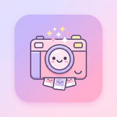
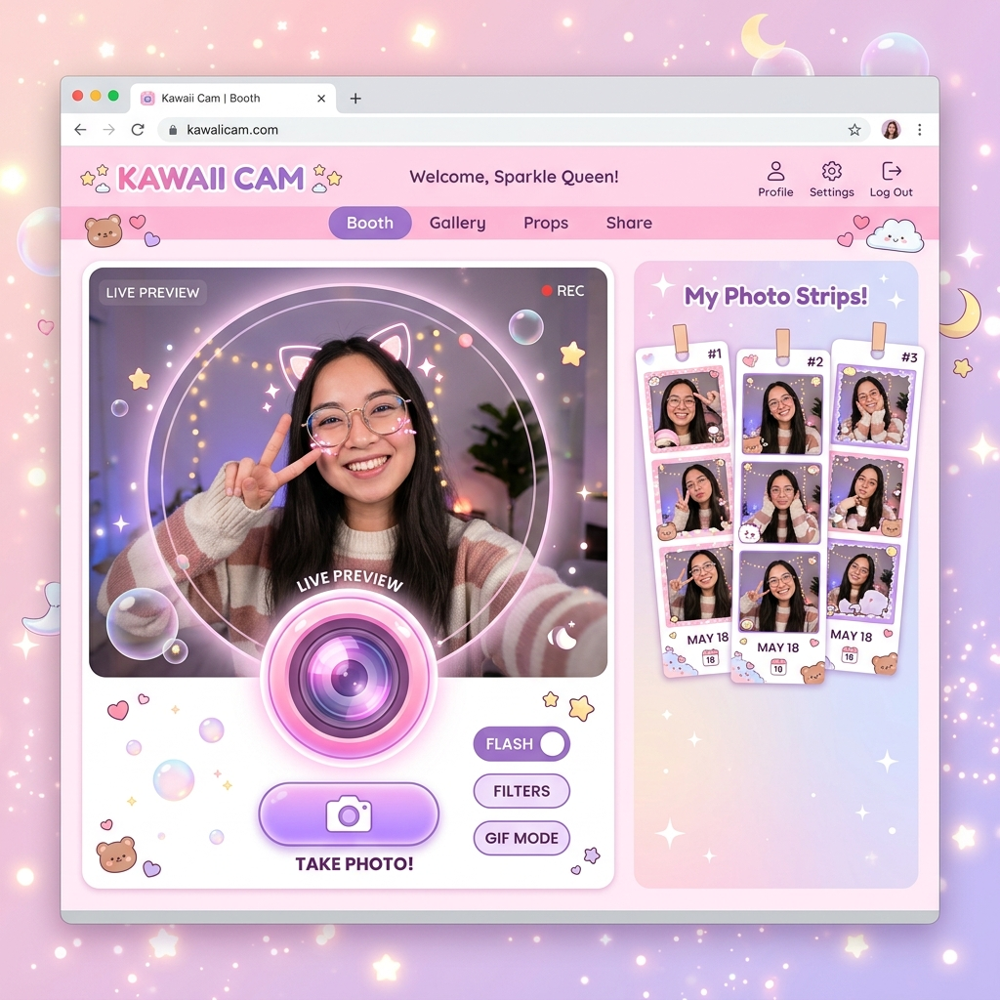

<div align="center">
  
  
  # 🌸 Cute Photobooth 🌸
  
  **Aplikasi Photobooth Web Modern yang Lucu, Estetik, dan Sangat Responsif!**
  
  [](https://opensource.org/licenses/MIT)
  []()
  []()
</div>

---

## 📸 Tentang Proyek

**CuteBooth** adalah aplikasi web *photobooth* gratis yang dibangun murni menggunakan **Vanilla HTML, CSS, dan JavaScript**. Tidak memerlukan server backend (Node.js/PHP), database, atau library pihak ketiga eksternal untuk berjalan. Seluruh proses manipulasi piksel, penerapan filter, render bingkai, dan pencetakan foto dilakukan secara 100% lokal di browser (*Client-Side Rendering*), menjamin keamanan privasi yang mutlak.

Dengan tampilan *glassmorphism* dan aksen warna pastel yang modern, CuteBooth dirancang untuk beradaptasi ke berbagai jenis perangkat, dari *smartphone* hingga TV layar lebar.

<div align="center">
  
</div>

## ✨ Fitur Utama

- 🔒 **Privasi Terjamin & Aman**: Semua rendering dilakukan di browser pengguna! Tidak ada satu byte gambar pun yang dikirim ke *cloud* atau server eksternal. (Didukung oleh *Strict Content Security Policy*).
- 📶 **Mode Offline (PWA)**: Berkat dukungan Service Worker yang tangguh, CuteBooth dapat di-*install* di *home screen* ponsel atau PC kamu dan bisa dijalankan kapan pun tanpa koneksi internet!
- 🎛️ **Kustomisasi Sepuasnya**:
  - **Sesi Bebas**: Pilih preset foto (1, 3, 4, 6) atau ketik jumlah foto hingga **20 kali potret** berturut-turut!
  - **Timer Khusus**: Hitung mundur yang bisa dikustomisasi secara manual dari 1 hingga 60 detik.
- 🎨 **19 Filter Kece**: Dari *Vintage*, *Neon*, *Cyberpunk*, *Matrix*, hingga *Polaroid*, ubah warna fotomu layaknya profesional.
- 🖼️ **18 Bingkai Aesthetic**: Tersedia berbagai *frame* unik (Kawaii, Y2K, Floral, Space, dll.) lengkap dengan warna border *gradient* dan stiker emoji.
- 🖨️ **Ekspor & Cetak Cepat**: Render hasil potretan menjadi sebuah *photo strip* yang panjang, bisa langsung di-download sebagai gambar berkualitas tinggi (PNG) atau dicetak secara fisik lewat *Print Dialog*.

## 📂 Struktur Folder

Struktur proyek disusun agar mudah dirawat, dimodifikasi, dan bebas kerumitan:

```text
📁 photobooth/
├── 📄 index.html        # Struktur markup aplikasi dan Meta Tags SEO PWA
├── 📄 manifest.json     # Konfigurasi instalasi PWA
├── 📄 sw.js             # Service Worker untuk Offline Caching
└── 📁 assets/
    ├── 📁 css/
    │   └── 📄 style.css # File gaya dengan desain modern & responsif
    ├── 📁 js/
    │   └── 📄 app.js    # Logic utama: Kamera, PWA, Filter JS, dll
    └── 📁 images/       # Koleksi favicon, ikon PWA, dan screenshot preview
```

## 🚀 Cara Menjalankan

Karena tidak memerlukan server backend, aplikasi ini sangat mudah dijalankan:

1. Kloning / *Download* repositori ini.
2. Buka file `index.html` menggunakan browser modern (Google Chrome, Microsoft Edge, Safari, Mozilla Firefox).
3. Izinkan akses kamera ketika browser meminta konfirmasi.
4. Nikmati aplikasinya!

> **Catatan Untuk Mode PWA**: Untuk mengetes kemampuan *Offline Mode*, sangat disarankan untuk menjalankan aplikasi via *Local Web Server* (seperti `Live Server` pada VS Code) karena Service Worker biasanya memerlukan akses ke `localhost` atau HTTPS.

## 🛡️ Keamanan & Optimasi SEO

- **Anti-XSS**: Dilindungi oleh header `<meta http-equiv="Content-Security-Policy">`.
- **SEO & OGP**: Ditulis dengan struktur Meta Tags yang lengkap untuk mendominasi mesin pencari dan menampilkan preview aplikasi cantik saat *link* dibagikan di jejaring sosial.

## 👨‍💻 Penulis

- **[@Xnuvers007](https://github.com/Xnuvers007)**

## 📜 Lisensi

Aplikasi ini bersifat **Open-Source** dan bisa digunakan oleh siapa saja. Mari bersenang-senang dan abadikan kenangan manismu! 🌸✨
